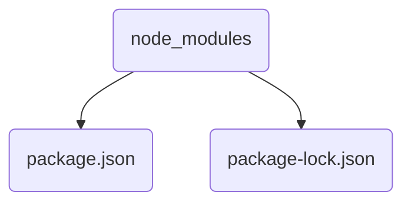
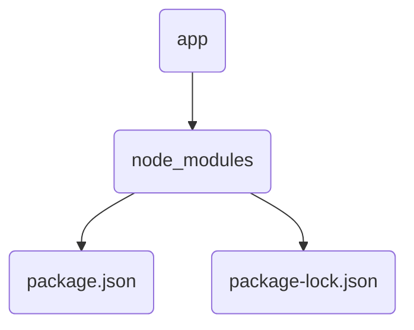
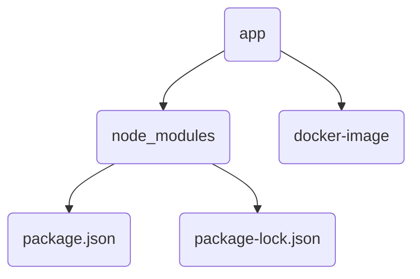
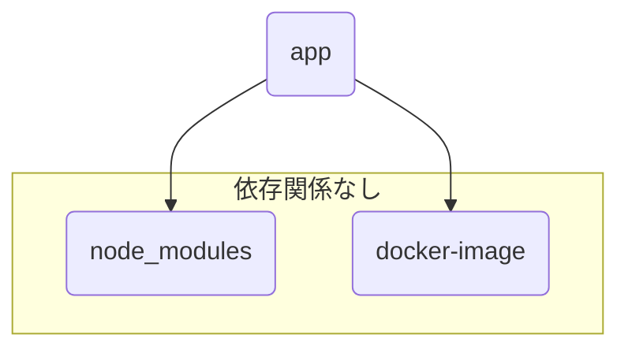

浮かない顔をしておるな。ワケを話してみよ。

## npmの依存パッケージが増えた
ふむ。**npmで依存パッケージを増やした**と。それで？　なに、**他の開発者から _動かない_ と言われた**のか。で、**毎回 _`npm ci`をしてくれ_ と頼んでいる**わけか。

…その問題、**半世紀ほど前に解決されておるぞ。**

何かの縁じゃ。お主に**開発環境を自動更新する古来の術式**を教えてやろう。

### 詠唱準備
手始めに適当なパッケージを作るかの。今からの操作は空ディレクトリの中で作業していくぞ。
お主が[Node.js](https://nodejs.org/ja/)をインストール済であれば、

```sh
$ npm init -y
$ npm install --save express
```

これで、`package.json` と `package-lock.json`、そして `node_modules` ができるはずじゃ。

```
$ ls
node_modules  package-lock.json  package.json
```

これを[git](https://git-scm.com/)リポジトリで管理するかの。

```sh
$ git init
```

お主が[npm](https://www.npmjs.com/)を利用したアプリケーションをgitで管理したことがあるなら、`node_modules` ディレクトリはリポジトリに含めないことを知っておるじゃろう

```sh
echo 'node_modules/' > .gitignore # node_modules以下はgitの管理外
git add .gitignore package.json package-lock.json
git commit -m 'Initial commit'
```

なぜか？

理由はいくつかあるじゃろうが大前提として
**`node_modules` は `package.json` や `package-lock.json`から構築できるから**じゃ。

### 術式

`node_modules` は `pacakge.json` や `package-lock.json` からできる。この考え方は非常に重要じゃ。

この**依存関係**を以下のような**術式**で表す。

```makefile
node_modules: package.json package-lock.json
```

`:` より左側を**ターゲット(target)**、右側を**必要条件（prerequisite）**　という。

今回、**必要条件からターゲットを構築する**ためには `npm ci` が必要じゃ。これらを踏まえ以下のような術式になる。

```makefile:Makefile
node_modules: package.json package-lock.json
	npm ci
```

`npm ci` に利いている **インデントはタブ** であることに注意するのじゃ。古来の術式ゆえな。丁寧に扱う必要がある。
この術式ひとまとまりを**ルール**と呼ぶ。

さて、この術式を **`Makefile` という名で保存する**のじゃ。

…そうじゃ。**古来の術式とは、makeのことじゃ。**

### 詠唱
`node_modules` は一度消しておくぞ。

```sh
$ rm -rf node_modules
```

よし。術式を起動するぞよ。

```sh
$ make node_modules
```


うむ。無事に `node_modules` が作成されたな。

ここで、**もう一度術式を起動してみよ。**


先程と振る舞いが違うじゃろう。
そうじゃ。 **`node_modules` は再作成されない**のじゃ。

### 術式解説
原理はシンプルじゃ。
先程組んだ術式を見ると

```makefile
node_modules: package.json package-lock.json
```

`node_modules` は `package.json` と `package-lock.json` に依存しておる。

依存関係をグラフにするとこういった形じゃな。



そしてここからがキモじゃが
makeの術式は**依存関係の中でターゲットが最新となるよう実行される。**

つまり

`node_modules` が `package.json`、`pacakge-lock.json` より**新しい**
→ `node_modules` の再作成は**不要**

`node_modules` が `package.json`、`pacakge-lock.json` より**古い**
→ `node_modules` の再作成は**必要**

とみなされる。

UNIX系ファイルにはatime（アクセス時間）、mtime（更新時間）、ctime（属性変更時間^[Windowsではファイル作成時間を[指すようです](https://stackoverflow.com/a/18521525/13409787)]）と呼ばれる時刻情報があるのじゃが^[[MAC times - Wikipedia](https://en.wikipedia.org/wiki/MAC_times)]
このうちmakeでは **mtimeの大小関係によってターゲットの再構築が必要かが判断される** のじゃ。^[mtimeは`ls -l`コマンドで確認できる]


## アプリ起動と組み合わせる
これだけじゃとまだ開発の恩恵は得られんの。実際にアプリ開発にどう活かすかも見せよう。

まず[expressのHello world exampleのコード](http://expressjs.com/en/starter/hello-world.html)でシンプルなWebサーバーを立ててみよう:

```js:server.js
const express = require('express')
const app = express()
const port = 3000

app.get('/', (req, res) => {
  res.send('Hello World!')
})

app.listen(port, () => {
  console.log(`Example app listening on port ${port}`)
})
```

これを `server.js` の名前で保存し、次の術式を`Makefile`の**先頭に**書くのじゃ。

```makefile
.PHONY: app
app: node_modules
	node server.js
```

インデントはタブであることを忘れるでないぞ。
`.PHONY` は**疑似ターゲット**のことじゃ。ここでは **`app` というファイルは作成されないが術式起動のキーワードとして便宜的に作成するターゲット**じゃ。
つまり **`.PHONY` ターゲットルールのコマンドスクリプトは常に実行される**ということじゃ。

いま`Makefile`全体はこのようになっておる。

```makefile:Makefile
.PHONY: app
app: node_modules
	node server.js

node_modules: package.json package-lock.json
	npm ci
```

依存関係をグラフ化しておくとこんな感じじゃな。



### 術式起動

術式を起動するぞよ。

```sh
$ make app
```


うむ。無事に起動したの。

Ctrl+Cを押して一度終了し、**node_modulesを消して**今一度やってみよ。

```sh
$ rm -rf node_modules
$ make app
```


**`npm ci` が自動で実行されてからアプリが起動した**じゃろう。
`app` ターゲットは `node_modules` に依存しておる。makeは**依存関係を解決するため**に、**`node_modules` の作成を先に行ってから**`app` ルールのコマンドスクリプトを実行したわけじゃ。

ちなみに術式の起動は `make` だけでもできる。**詠唱破棄**じゃな。

```
$ make
```

先程 `app` ターゲットを`Makefile`の先頭に書いたが、`make` は**ターゲットを指定しなければ最初に記述されたターゲットを実行する**のじゃ。

## git開発

これらの術式はgitを使う上で非常に役立つ。
これまでの作業を一度コミットしておこう。

```sh
$ git add Makefile server.js
$ git commit
```

一度ブランチを変えるぞ。`topic`ブランチを作成してチェックアウトする。

```sh
$ git checkout -b topic
```

パッケージを追加し先程のアプリを改修する。ログのフォーマットでも変えるかの。

```sh
$ npm install --save winston
```

```js:server.js
const express = require('express')
const winston = require('winston')
const app = express()
const port = 3000
const logger = winston.createLogger({
  transports: [new winston.transports.Console()]
});

app.get('/', (req, res) => {
  res.send('Hello World!')
})

app.listen(port, () => {
  logger.info(`Example app listening on port ${port}`)
})
```

:::details 一応差分をここに置いておく。

```diff js:server.js
diff --git a/server.js b/server.js
index cf5d04b..2ab3fec 100644
--- a/server.js
+++ b/server.js
@@ -1,11 +1,15 @@
 const express = require('express')
+const winston = require('winston')
 const app = express()
 const port = 3000
+const logger = winston.createLogger({
+  transports: [new winston.transports.Console()]
+});
 
 app.get('/', (req, res) => {
   res.send('Hello World!')
 })
 
 app.listen(port, () => {
-  console.log(`Example app listening on port ${port}`)
+  logger.info(`Example app listening on port ${port}`)
 })
```
:::

起動するとログフォーマットが無事に変わるかの。

```sh
$ make
node server.js
{"level":"info","message":"Example app listening on port 3000"}
```

うまくいっておれば、今一度コミットするぞ。

```sh
$ git add -u # 変更のあったファイルをステージング
$ git commit
```

### 依存パッケージの自動解決

元のブランチに切り替え、この後のわかりやすさのために`node_modules`を削除するぞ。

```sh
$ git checkout main # 元のブランチへ
$ rm -rf node_modules
```

先程と同様、アプリ起動時にはexpressを含めた依存パッケージがインストールされる。

```sh
$ make
npm ci
added 57 packages in 0.139s
node server.js
Example app listening on port 3000
```

そしてもう一度`topic`ブランチをチェックアウトしてアプリを起動すると…

```sh
$ git checkout topic
Switched to branch 'topic'
~/tmp/node-test on topic                                                     
$ make
npm ci
npm WARN prepare removing existing node_modules/ before installation
added 84 packages in 0.213s
node server.js
{"level":"info","message":"Example app listening on port 3000"}
```

**topicブランチで追加したパッケージが自動でインストールされてからアプリが起動する**ことがわかるかの。

gitのブランチを切り替えた際、**ブランチ間で差異があるファイルは書き換えが発生する。** 書き換えが発生すれば**mtimeは更新される。**
ブランチを切り替えると`package.json`と`package-lock.json`のmtimeが更新され、**`node_modules`のmtimeが`package.json`らのmtimeよりも古くなる**ため、アプリ起動時に`node_modules`ターゲットの再生成処理が発生した、というわけじゃ。

ブランチ切り替えの他にも、**`git pull`でファイルが更新されたばあいなども同様に自動インストールされる**ぞよ。

## Dockerのビルドを自動化する

同じ考え方で **[Docker](https://www.docker.com/)のビルドも自動化**してみよう。

### 準備
先程のアプリをDockerで起動するために、まず簡単な`Dockerfile`を作成するかの。

```dockerfile:image/Dockerfile
FROM node:14-alpine

CMD ["node"]
```

`image/`ディレクトリを作成し`image/Dockerfile`としてこれを保存するのじゃ。

術式を変えるぞ。

```diff makefile:Makefile
 .PHONY: app
-app: node_modules
-	node server.js
+app: node_modules docker-image
+	docker run --rm -it --volume=$(PWD):/home/node --user=node --workdir=/home/node \
+		$$(cat docker-image) node server.js
 
 node_modules: package.json package-lock.json
 	npm ci
+
+docker-image: image/Dockerfile
+	docker build -q image/ | tee docker-image

```

順を追って見ていこうかの。

### docker-imageターゲット
まず **`docker-image`ターゲットを追加し、`image/Dockerfile`を必要条件とした。**

```makefile
docker-image: image/Dockerfile
```

ただ**必要条件は`image`でも構わん。** 

```makefile
docker-image: image
```


これなら **`image`ディレクトリ内で`Dockerfile`以外のファイルが変更されてもターゲットが再生成される**からの。
`Dockerfile`で`COPY`コンテキストを利用するばあいなど、`image`ディレクトリ内にファイルを追加することがあれば、こっちの方がよいかもしれんの。

`docker-image`の生成は`docker build`コマンドで行う。

```makefile
docker-image: image/Dockerfile
	docker build -q image/ | tee docker-image
```

`docker build -q image`で`image/Dockerfile`のビルドを行うと、`-q`フラグによってビルド後にイメージハッシュが出力される。

```sh
$ docker build -q image/
sha256:83894396cac1aeb30055b390ec6c17152a9904fb0103ff560c2db51189fd82e5
```

これを`tee`コマンドで`docker-image`ファイルに保存しているわけじゃな。

```makefile
docker-image: image/Dockerfile
	docker build -q image/ | tee docker-image
```

ちなみにビルドしたコンテナイメージにタグ名をつけて管理するなら、`docker-image`ファイルは`touch`コマンドで作成してもよい。^[`touch`は標準でファイルのmtimeを現在時刻に更新する。ファイルがなければ空ファイルを作成する]

```makefile
docker-image: image/Dockerfile
	docker build -t some-name image # some-name というタグ名を付与
	touch docker-image # 空ファイルを作成
```

この例だと`some-name`というタグ名を付与しておる。いざイメージを使おうというときに`some-name`を利用できるから、イメージハッシュを保存しておく必要はないというわけじゃな。^[`docker run ... some-name node server.js`とできる]

ただこのばあいでも **`docker-image`ファイルは`touch`コマンドで生成しておる。**^[`touch`を「印を結ぶ」と表現したかったが伝わりにくいと考えボツにした]

```makefile
	touch docker-image # 空ファイルを作成
```

`docker-image`を _ハッシュを書き込んで作成する_ にしても _`touch`を利用し空ファイルとして作成する_ にしても、**このファイルはmtimeを保持することになり、最後にビルドした時刻が記録される**ことになるのじゃ。

なお`docker-image`ファイルはgitで管理する必要がないため、ignoreしておくのじゃ。

```sh
$ echo docker-image >> .gitignore
```

### appターゲット
`app`ターゲットの必要条件に`docker-image`を追加した。

```makefile
.PHONY: app
app: node_modules docker-image
```

これによって**アプリの起動は`docker-image`ターゲットに依存する**ことになる。

アプリの起動方法は`docker`を利用した起動に変えた。

```makefile
.PHONY: app
app: node_modules docker-image
	docker run --rm -it --volume=$(PWD):/home/node --user=node --workdir=/home/node \
		$$(cat docker-image) node server.js
```

新しい術式が増えたためいくつか解説しておく。このあたりも少々クセがあるが、難しいものではないじゃろう。

#### 変数
`$(PWD)`は変数`PWD`をコマンドに埋め込んでおる。
変数の値を利用するばあい **`$`記号の後に変数名を記述する**のじゃが、**1文字を超える変数は丸括弧`()`で囲む必要がある。**

この変数は**環境変数からも読み込まれる**ため、変数`PWD`はカレントディレクトリパスになる。

もちろん**自身で定義することもできる**し、**術式起動時にも渡すこともできる。**

変数の代入にはいくつか方法がある。詳しい解説は省くが、いくつか紹介しておこう。^[[GNU Make 第3版](https://www.oreilly.co.jp/library/4873112699/) 3.4「変数はいつ展開されるか」を参考とした。一部の刷に[誤植がある](https://www.oreilly.co.jp/books/4873112699/#:~:text=%E3%81%AA%E4%B8%80%E5%86%8A%E3%81%A7%E3%81%99%E3%80%82-,%E6%AD%A3%E8%AA%A4%E8%A1%A8,-%E7%9B%AE%E6%AC%A1)ので注意]

| 記述 | 挙動 | 右辺が展開されるタイミング |
| --- | --- | --- |
|`x = value`|`x`に`value`を設定する|利用される箇所で遅延展開|
|`x := value`|`x`に`value`を設定する|宣言箇所で直ちに展開|
|`x ?= value`|`x`が未定義なら`value`を設定する|遅延展開か直ちに展開|
|`x += value`|`x`の末尾に`value`を追加する|遅延展開か直ちに展開|

術式起動時には同様の記法で変数を設定することができる。

```sh
$ make target key:=value # 変数keyにvalueを設定
```

#### コマンドスクリプトと改行
各ルールのコマンドスクリプトには**1行に1つのコマンドを記述する。**
複数行に渡って書きたいばあいは、**末尾をバックスラッシュ（`\`）でエスケープする必要がある。**
このあたりは一般的なシェルスクリプトと同様じゃな。

```makefile
	docker run --rm -it --volume=$(PWD):/home/node --user=node --workdir=/home/node \
		$$(cat docker-image) node server.js
```

注意点として、**コマンドごとに別のシェルプロセスが起動する**ため、cdコマンドを利用してカレントディレクトリを変えながらコマンドを実行したいばあいなどは、**1つのシェルプロセス内で処理を完結する必要がある。**

```makefile
some-target:
	echo $(PWD) # /home/user
	cd somewhere
	echo $(PWD) # /home/user # cdコマンド実行プロセスとは別プロセス
	cd somewhere; echo $(PWD) # /home/user/somewhere
```

#### `$`のエスケープ

コマンドで`$`を表現したいばあいには **`$$`のように書くことでエスケープできる。** サンプルの`$$(cat docker-image)`ではシェルのコマンド展開記法`$(...)`の`$`をエスケープしておる。


### 術式完成

さて、以下のような術式ができた。

```makefile:Makefile
.PHONY: app
app: node_modules docker-image
	docker run --rm -it --volume=$(PWD):/home/node --user=node --workdir=/home/node \
		$$(cat docker-image) node server.js

node_modules: package.json package-lock.json
	npm ci

docker-image: image/Dockerfile
	docker build -q image/ | tee docker-image
```

依存関係をグラフにするとこうじゃ。



術式を試してみよう。

```sh
$ rm -rf node_modules docker-image # 動作確認のため一度消す
$ make
npm ci
added 57 packages in 0.132s
docker build -q image/ | tee docker-image
sha256:83894396cac1aeb30055b390ec6c17152a9904fb0103ff560c2db51189fd82e5
docker run --rm -it --volume=/home/user/sample-app:/home/node --user=node --workdir=/home/node \
                $(cat docker-image)
Example app listening on port 3000
```

**パッケージのインストールやイメージのビルドが自動化された**の。
`image/Dockerfile`内の`FROM node:14-alpine`を`FROM node:16-alpine`にしてみるなどして更新すると、**次の起動時には自動でビルドが行われる。**　これは自身で試してみるとよい。

### 応用
同様の発想で例えばマイグレーション用のSQLファイルが追加されたら自動でマイグレーションを行うといったこともできる。

```makefile
app: migrate

# sqlディレクトリが更新されたら実行されるルール
migrate: sql
		bin/migrate.sh
		touch migrate # マイグレーション最終実行時刻を保持
```

**「何かをしたあとに何かを実行する」という依存関係**があるならば、これらは**makeのルールで書き起こして自動化するチャンス**かもしれんの。

## 他役に立つこと
ついでにいくつかの知識を授けておこう。

### ルールの並列実行
`make`コマンドに`-j`オプションを指定すると、**並列化可能なルールは並列実行される。** 例えば`-j2`とすれば、最大2つのルールを並列実行できる。

例えばサンプルの術式起動では

```sh
$ make -j2 app
```

とすることで、**npmパッケージのインストールとDockerイメージのビルドを並列で実行することができる**のじゃ。
`app`ターゲットの必要条件である、**`node_modules`と`docker-images`は互いに依存してない**からの。並列実行しても問題ないゆえ、**よしなにmakeが並列化してくれる**というわけじゃ。^[依存関係の解決はトポロジカルソートのアルゴリズムを使っているそうです: [makefile - How does the make "-j" option actually work? - Stack Overflow](https://stackoverflow.com/a/2367370/13409787)]



### 環境差異の吸収
開発者ごとの環境差異を吸収するのにもmakeの術式は役立つぞよ。
術式を少し変えてみよう。

```makefile:Makefile
NPM := npm
NODE := node

-include myconf.mk

.PHONY: app
app: node_modules
	$(NODE) server.js

node_modules: package.json package-lock.json
	$(NPM) ci
```

:::details 差分もここに置いておく。
```diff makefile:Makefile
+NPM := npm
+NODE := node
+
+-include myconf.mk
+
 .PHONY: app
-app: node_modules docker-image
-	docker run --rm -it --volume=$(PWD):/home/node --user=node --workdir=/home/node \
-		$$(cat docker-image) node server.js
+app: node_modules
+	$(NODE) server.js
 
 node_modules: package.json package-lock.json
-	npm ci
-
-docker-image: image/Dockerfile
-	docker build -q image/ | tee docker-image
+	$(NPM) ci
```
:::

前半と同様Dockerコンテナを使わないルールじゃが、コマンド部分を変数に変えておるな。

```makefile
NPM := npm
NODE := node
```

```makefile
	$(NPM) ci
```

そして`include`文が登場しておる。これにより、**別のMakefileを読み込むことができる。**

```makefile
-include myconf.mk
```

頭に`-`をつけると**ファイルが存在しないばあいもエラー終了せずに処理を続行することができる。**
つまり **`myconf.mk`で術式をカスタマイズすることができる**のじゃ。**後述詠唱**とでも呼ぼうかの。

例えば`myconf.mk`を作成し以下のような術式を展開する。

```makefile:myconf.mk
NODE := docker run --rm -it --volume=$(PWD):/home/node --user=node --workdir=/home/node \
	$$(cat docker-image)

app: docker-image # 依存関係の追加

docker-image: image/Dockerfile
	docker build -q image/ | tee docker-image
```

`NODE`変数を`docker`コマンドで置き換え、`app`ターゲットの依存関係を追加した。
つまり前述のDockerコンテナによるアプリ起動は**オプションになった**のじゃ。

Node.jsの開発であれば、ランタイムを例えば[nodenv](https://github.com/nodenv/nodenv)や[volta](https://volta.sh/)で管理したい開発者もおるじゃろう。
そのばあいも`myconf.mk`に記述すれば簡単にランタイムを変更できる。

```makefile:myconf.mk
# nodenvでバージョン指定
NODE := NODENV_VERSION=14.17.0 node
# make app時にこうなる
# $ NODENV_VERSION=14.17.0 node server.js

# voltaでバージョン指定
NODE := volta run --node=14.17.0 node
# make app時にこうなる
# $ volta run --node=14.17.0 node server.js
```

また **`export`文を用いれば`make`実行時の環境変数になる。**

```makefile:myconf.mk
# make実行時の環境変数
export NODENV_VERSION := 14.17.0
```

**コマンドは変数にしておきカスタマイズ用のinclude文を記述しておく。** この術式パターンは鉄板じゃ。
コマンド置き換えなどのサンプルは、READMEやサンプル用`.mk`ファイル^[Makefileの一般的な拡張子。`.makefile`と書くことも]をリポジトリに含めるなどしておくと親切じゃな。^[例えば`change-node-runtime.mk.sample`というファイルをリポジトリに含める]

またカスタム用のファイルは各開発者に依存したファイルになるため、**gitリポジトリの管理対象外にしておくこと**を忘れるでないぞ。

```sh
$ echo myconf.mk >> .gitignore
```

### 自動インストール時のmtime更新
例えばPHPの開発じゃと`composer install`で依存ライブラリをインストールするじゃろう。
ただ[composer](https://getcomposer.org/)はインストールすべきライブラリがないときに`vendor`ディレクトリを更新しないため、mtimeが更新されないことがある。
こういったばあい、**`touch`して明示的にmtimeを更新する**しておくとよいぞ。

```makefile
vendor: composer.json
	composer install
	touch vendor # mtimeを更新
```

### dry-run起動
各ルールが正しく実行されるか、術式起動前に確認したいこともあるじゃろう。
`-n`、`--just-print`、`--dry-run`、`--recon`オプションはいずれもdry-runのためのオプションで、術式起動時のコマンドを実行せずに出力してくれる。^[どのオプションでも違いはない]

`Makefile`作成時には役に立つことじゃろう。

## 偉大なる書

makeの各術式や活用例はオライリー・ジャパンGNU Make 第3版に詳しく載っておる。

https://www.oreilly.co.jp/library/4873112699/

なんと**上記リンクから無料PDFで公開されておる**のじゃ。^[[GNU Free Documentation License](https://www.oreilly.co.jp/library/4873112699/appC.pdf)に基づき公開されている]

もちろん紙の書籍を購入することもできる。
より奥深い世界に興味があれば一読してみるとよい。

---

## あとがき
makeの起源は　_「コードを直したのに実行ファイルを更新しないままデバッグして度々無駄な時間を費やす」という同僚の問題_ から、1976年に[スチュアート・フェルドマン](https://en.wikipedia.org/wiki/Stuart_Feldman)博士が閃いたものです。^[[Origin -- Make (software) - Wikipedia](https://en.wikipedia.org/w/index.php?title=Make_(software)&oldid=1086313103#Origin)]
スチュアート博士はmakeを生み出したことで[ACM Software System Award](https://awards.acm.org/software-system)を[2004年に受賞しています](https://web.archive.org/web/20061213153355/http://www.acm.org/announcements/softwaresystemaward.3-24-04.html)。

実際makeは今年イチコスパのよい勉強だったなと思っており、開発における恩恵を日々感じています。
例えば最後に紹介した `Makefile` はたった10行です。

```
NPM := npm
NODE := node

-include myconf.mk

.PHONY: app
app: node_modules
	$(NODE) server.js

node_modules: package.json package-lock.json
	$(NPM) ci
```

こういった記述をちょろっとするだけで開発上のフラストレーションがどっと削減され、また _各操作で何を行うのか_ といったことも`--dry-run`オプションですぐに確認できるわかりやすさがあります。

makeと言うと _「あんな古いものをどうして今更…」_ という反応を何度か体験したことがありますが、makeはGo言語の開発でも一般的に使われている^[「Go言語ではMakefileを推奨する」といった文献は知りませんが、言語文化としてMakefileを利用したプロジェクトは多いと考えています。異議あればコメント願います]ように、優れたビルド・自動化ツールとして生き残り続けています。

**開発の体験をよりよくしたい開発者の方は、ぜひ一度利用してみることをオススメします。**

## 動作確認環境について
makeにはGNU実装とBSD実装とがあり、方言の違いがあります。

本記事の動作はmacOSに標準でインストールされていたGNU Make3.81を利用して確認しましたが、なるべく基本的な構文のみを利用するよう配慮しました。

```
$ make -v
GNU Make 3.81
Copyright (C) 2006  Free Software Foundation, Inc.
This is free software; see the source for copying conditions.
There is NO warranty; not even for MERCHANTABILITY or FITNESS FOR A
PARTICULAR PURPOSE.

This program built for i386-apple-darwin11.3.0
```

## 文中の表現について
_「make」という言葉で記事をそっ閉じされずにmakeの忘れられた良さを如何に伝えられるか_ が本記事の課題でした。

表現としてこういった形になり賛否あるかと思いますが、あしからず受け取っていただけますと幸いです。

語弊がある表現などあればコメントや[GitHubから](https://github.com/na0x2c6/zenn_dev-contents/blob/main/articles/buff-your-development.md)の編集提案でご連絡ください。

## 謝辞
末筆ながらmakeの良さに気づかせてもらえたのはクラスメソッドさんの記事でした。この場を借りてお礼申しあげます。

https://dev.classmethod.jp/articles/lambda-deploy-with-make/
